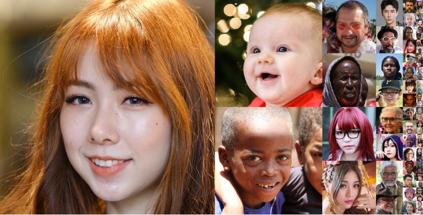

# Awesome-GAN-Training-Dataset

This repository contains a curated list of GAN training datasets.

## Table of contents 

- [Human Face](#human-face)
- [Style Transfer](#style-transfer)
- [Large Scale Dataset](#large-scale-dataset)

## Human Face

* [FFHQ](https://github.com/NVlabs/ffhq-dataset)

    Flickr-Faces-HQ (FFHQ) is a high-quality image dataset of human faces, consists of 70,000 high-quality PNG images at 1024×1024 resolution and contains considerable variation in terms of age, ethnicity and image background.
    

* [non-hair-FFHQ](https://github.com/oneThousand1000/non-hair-FFHQ)

    The non-hair-FFHQ dataset is a high-quality image dataset that contains 6,000 non-hair FFHQ portraits, based on stylegan2-ada and ffhq-dataset.
    

* [CelebA](https://mmlab.ie.cuhk.edu.hk/projects/CelebA.html)

    CelebFaces Attributes Dataset (CelebA) is a large-scale face attributes dataset with more than 200K celebrity images, each with 40 attribute annotations. 
    
    

* [CelebAMask-HQ](http://mmlab.ie.cuhk.edu.hk/projects/CelebA/CelebAMask_HQ.html)

    CelebAMask-HQ is a large-scale face image dataset that has 30,000 high-resolution face images selected from the CelebA dataset by following CelebA-HQ. The masks of CelebAMask-HQ were manually-annotated with the size of 512 x 512 and 19 classes including all facial components and accessories such as skin, nose, eyes, eyebrows, ears, mouth, lip, hair, hat, eyeglass, earring, necklace, neck, and cloth.
    

* [MetFaces](https://github.com/NVlabs/metfaces-dataset)

    MetFaces is an image dataset of human faces extracted from works of art. The dataset consists of 1336 high-quality PNG images at 1024×1024 resolution.
    

* [AAHQ](https://github.com/onion-liu/aahq-dataset)

    Artstation-Artistic-face-HQ (AAHQ) is a high-quality image dataset of artistic-face images. The dataset consists of about 25,000 high-quality artistic images collected from the "portraits" channel of Artstation. It offers a lot of variety in terms of painting styles, color tones and face attributes.
    

## Style Transfer

## Large Scale Dataset

